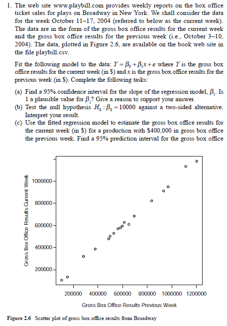
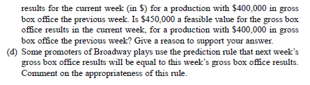

Load www.playbill.com, data for week of October 11-17, 2004. Data is downloaded from http://www.stat.tamu.edu/~sheather/book/data_sets.php website.

```{r, echo=T, warning=F, message=F}
library(knitr)    # Report display, table format
library(kableExtra)

#Load data
playbill <- read.csv("playbill.csv", header= TRUE, stringsAsFactors = F)
```

_(a) Find a 95% confidence interval for the slope of the regression model, $\beta_1$. Is 1 a plausible value for $\beta_1$ ? Give a reason to support your answer._

```{r}
options("scipen"=100, "digits"=4)
#Generate linear model
#We will be predicting current week results using last week results 
play.lm <- lm(data = playbill, CurrentWeek ~ LastWeek)
summary(play.lm)

```

Linear model in the form of $Y = \beta_0 + \beta_1X$ is $CurrentWeek = `r play.lm$coefficients[1]` + `r play.lm$coefficients[2]`LastWeek$.

Slope of the line is $\beta_1 = 0.98$. 95% confidence interval for the slope = $\beta_1 \pm (t^* \times SE(\beta_1))$, where $t^*$ is t-distribution for 16 degrees of freedom. 

```{r}
#t-distribution for 16 DF. 95% is 2.5% and 97.5% for 2 tail

tdis <- qt(0.975, 16)
b1 <- play.lm$coefficients[2]
se <- coef(summary(play.lm))[, "Std. Error"][2]
CI <- b1 + c(-1,1) * tdis * se

```

95% confidence interval is [`r CI`]

Confidence interval can directly obtained using `confint()` R function.

```{r}
CI <- confint(play.lm)["LastWeek", ]
```
95% confidence interval is [`r CI`]

Yes, `1` is a plausible value as it falls between lower and upper values of 95% confidence interval.

_(b) Test the null hypothesis $H_0$ : $\beta_0$ = 10000 against a two-sided alternative. Interpret your result._

Using regression model, $\beta_0 = `r play.lm$coefficients[1]`$

Null hypothesis $H_0$ : $\beta_0 = 10000$
Alternative hypothesis $H_A$ : $\beta_0 \ne 10000$

Lets derive values for 95% confidence interval for $\beta_0$ = $\beta_0 \pm (t^* \times SE(\beta_0))$. Where $t^*$ is t-distribution for 16 degrees of freedom.

```{r}
#t-distribution for 16 DF. 95% is 2.5% and 97.5% for 2 tail

tdis <- qt(0.975, 16)
b0 <- play.lm$coefficients[1]
se <- coef(summary(play.lm))[, "Std. Error"][1]
CI <- b0 + c(-1,1) * tdis * se

```

95% confidence interval for $\beta_0$ is [`r CI`].

Using `confint()` R function

```{r}
CI <- confint(play.lm)["(Intercept)", ]

```
95% confidence interval for $\beta_0$ is [`r CI`].

Since $\beta_0 = 10000$ falls between upper and lower values of 95% confidence interval, we accept null hypothesis $H_0$. In other words, we are 95% confident that the intercept $\beta_0$ can assume a value of $10000$.

_(c) Use the fitted regression model to estimate the gross box office results for the current week (in \$) for a production with \$400,000 in gross box office the previous week. Find a 95% prediction interval for the gross box office results for the current week (in \$) for a production with \$400,000 in gross box office the previous week. Is \$450,000 a feasible value for the gross box office results in the current week, for a production with $400,000 in gross box office the previous week? Give a reason to support your answer._

To answer above question, I will be using `predict()` R function.

```{r}
newdata = data.frame(LastWeek=400000)
PI <- predict(play.lm, newdata, interval="predict", level=.95)
```

The prediction interval for current week for a production with \$400,000 in gross box office the previous week is [`r PI`]. Fitted value: `r PI[1]`, Lower value: `r PI[2]` and Upper value: `r PI[3]`. Since \$450,000 does not fall between lower and upper values of prediction interval, it is not feasible.

_(d) Some promoters of Broadway plays use the prediction rule that next week's gross box office results will be equal to this week's gross box office results. Comment on the appropriateness of this rule._


```{r}
#Create data frame with current week values as last week
newdata = data.frame(LastWeek=playbill$CurrentWeek)
#Generate confidence inverval

PI <- predict(play.lm, newdata, interval="confidence", level=.95)
PI <- data.frame(PI)
PI$LastWeek <- newdata$LastWeek
PI$Play <- playbill$Production
#Display data
PI %>% 
  kable(format="html", caption = "Confidence Invervals") %>% 
  kable_styling(bootstrap_options = c("striped", "hover", "condensed", "responsive"), full_width = F, position = "left")

```

I do not 100% agree with promoters because next week's gross box office results could be close to the lower value of confidence interval, which is less than current week's gross box office results.


####References
- http://www.r-tutor.com/elementary-statistics/simple-linear-regression/confidence-interval-linear-regression
- https://onlinecourses.science.psu.edu/stat501/node/15
- Linear Models With R By Julian J. Faraway

